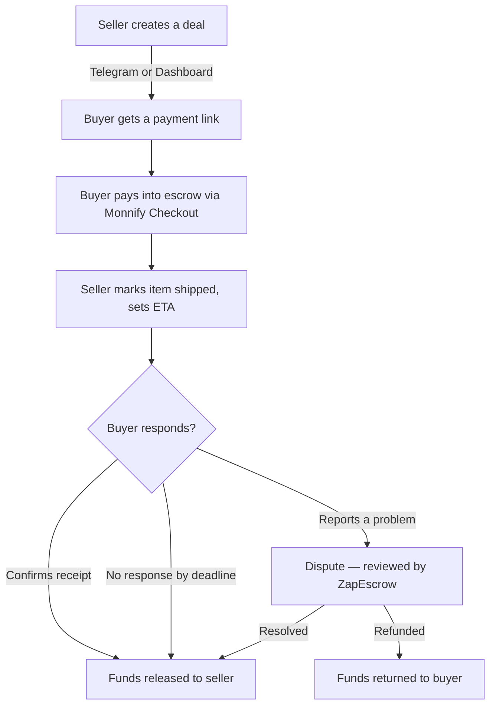
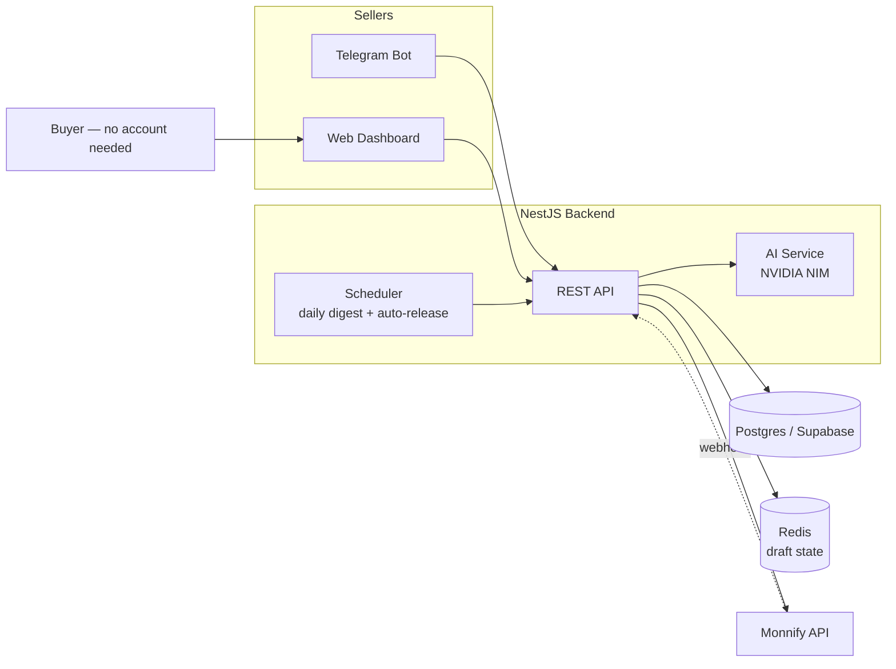
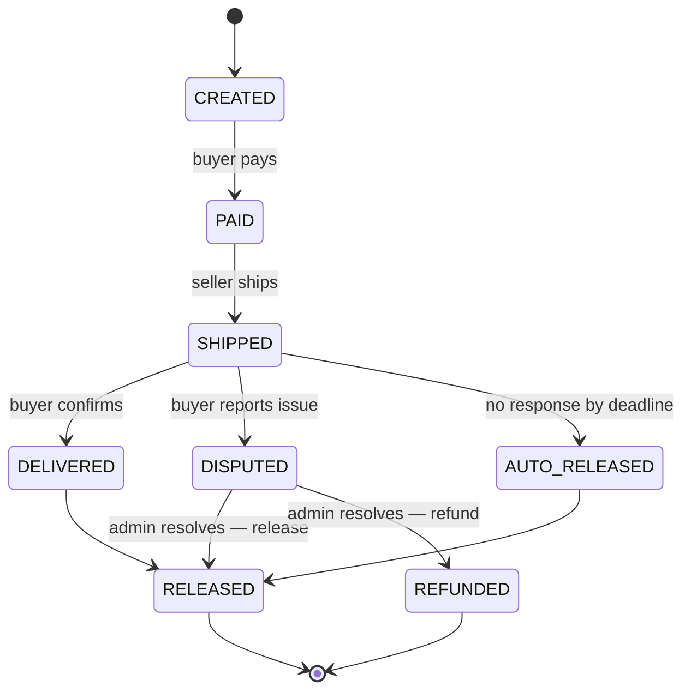

# ZapEscrow

**Never lose a sale to "is this a scam?" again.**

ZapEscrow is an AI-powered escrow platform for Nigerian social commerce. Buyers pay into escrow instead of straight to a seller's account — funds are held safely and only released once the buyer confirms delivery, or automatically after a response window closes if they go silent. Built on [Monnify](https://monnify.com) for payment collection and disbursement.

Built for the APIconf x Monnify Hackathon by **Zainab Wahab** and **Khayrah AbdulWahab**.

---

## The problem

Every day, small sellers on Instagram, WhatsApp, Tiktok and Twitter lose sales to buyers who don't trust them enough to pay upfront — and buyers who *do* pay have no recourse if a seller never delivers. Every DM sale runs purely on faith, with no system backing either side.

This isn't a new problem, and it's already been solved once: **Alipay's escrow system for Taobao** is widely credited with unlocking Chinese e-commerce at scale. Buyer pays into escrow → seller ships → buyer confirms receipt → *then* the seller gets paid. If the buyer goes silent, funds auto-release to the seller after a fixed window, so nobody can hold the other hostage.

ZapEscrow brings that same trust mechanism to Nigerian social commerce, powered by Monnify.

---

## How it works



**The buyer never needs an account.** They get one link — used to pay, and later revisited to confirm receipt or report a problem. That same link works as a living status page for the life of the deal; email reminders (where a buyer email is available) just nudge them back to it.

---

## Two ways in, one backend

- **Telegram bot** (`@ZapEscrowBot`) — sellers describe a deal in plain English ("sold 2 phone cases to Musa for 3000 each"), and AI parses it into a structured deal automatically. Handles deal creation, shipment updates, disbursement account setup, and daily digests.
- **Web dashboard** — landing page, authenticated seller dashboard with deal management, settlement account setup, and a dispute review queue.

Both interfaces talk to the same NestJS backend and Postgres database — a deal created on Telegram shows up instantly on the dashboard, and vice versa.

---

## Monnify features used

| Feature | Purpose |
|---|---|
| **Checkout API** | Collects buyer payment into escrow via a hosted payment page |
| **Single Disbursement API** | Releases escrowed funds to the seller's bank account on completion |
| **Name Enquiry** | Verifies a seller's bank account name before saving it, preventing payout typos |
| **Bank List API** | Populates the full list of supported Nigerian banks in both Telegram and the dashboard |
| **Webhooks** | Notifies the backend the moment a payment completes, triggering the next step in the deal lifecycle |

---

## Architecture



**Stack**: NestJS + TypeScript + Prisma (backend), React + Vite + Tailwind (dashboard), Postgres via Supabase, Redis for in-progress Telegram deal drafts, Telegraf for the bot, Resend for transactional email, NVIDIA NIM (Llama 3.1) for natural-language deal extraction.

---

## Deal lifecycle



Every transition is logged in a `deal_events` audit table — who triggered it (buyer, seller, or system), and why — so the full history of any deal can be reconstructed.

---

## Trust & safety design notes

- **Dispute resolution is admin-gated.** Sellers can see that a dispute exists and its status, but only an authenticated admin account can resolve it (release or refund) — a seller cannot release funds to themselves.
- **Idempotent webhooks.** Every Monnify webhook event is checked against a `transactionReference` before being acted on, so a duplicate delivery can't double-process a payment.
- **Auto-release protects sellers from silent buyers**, mirroring Alipay/Taobao's model — a buyer can't withhold payment indefinitely just by not responding.
- **Buyers stay fully accountless** — no signup, no password, ever. Their payment link doubles as their confirmation and dispute-reporting mechanism for the life of the deal.

---

## Project structure

```
zapescrow/
├── escrow-backend/     # NestJS API, Telegram bot, Prisma schema, scheduler
└── escrow-dashboard/   # React dashboard + landing page
```

## Getting started

### Backend

```bash
cd escrow-backend
npm install
cp .env.example .env   # fill in Monnify, Supabase, Redis, NVIDIA, Resend, Telegram credentials
npx prisma generate
npx prisma migrate deploy
npm run start:dev
```

### Dashboard

```bash
cd escrow-dashboard
npm install
cp .env.example .env   # set VITE_API_BASE_URL to your backend URL
npm run dev
```

See each folder's `.env.example` for the full list of required environment variables.

---

## Known limitations (honest scope notes)

Built under a hackathon deadline — a few things are intentionally left as documented next steps rather than half-built:

- Dispute resolution supports release/refund but doesn't yet include a broader multi-reviewer process.
- Refund-to-buyer is tracked in the data model but not yet wired to a live Monnify refund call.
- The webhook handler currently acts on `SUCCESSFUL_TRANSACTION` events; `EXPIRED`, `FAILED`, and disbursement/settlement event types are received and stored but not yet acted on.
- SMS is not used for buyer notifications — email nudges point back to the buyer's persistent status-page link instead, which works whether or not an email was provided.

---

## Team

- **Zainab Wahab** — [github.com/zainabwahab-eth](https://github.com/zainabwahab-eth) · [LinkedIn](https://linkedin.com/in/zainab-wahab-8280ba326)
- **Khayrah Wahab** — [LinkedIn](https://www.linkedin.com/in/khayrah-wahab)

---

## License

Built for a hackathon submission. Not currently licensed for reuse.
